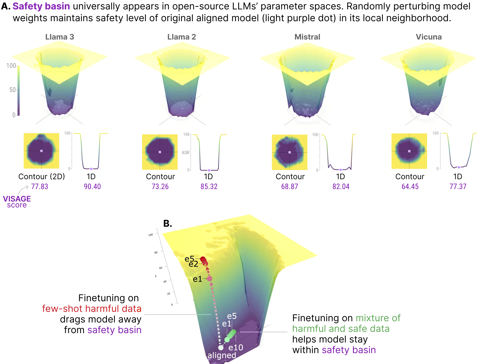

# [NeurIPS'24] Navigating the Safety Landscape: Measuring Risks in Finetuning Large Language Models

[](https://arxiv.org/abs/2405.17374)

- We discover a new phenomenon observed universally in the model parameter space of popular open-source LLMs, termed as **safety basin**: randomly perturbing model weights maintains the safety level of the original aligned model in its local neighborhood.
- Visualizing the safety landscape of the aligned model enables us to understand, for the first time, how finetuning compromises safety by dragging the model away from the safety basin. 
- LLM safety landscape also highlights the system prompt's critical role in protecting a model, and that such protection transfers to its perturbed variants within the safety basin.
- When evaluating the safety landscape using jailbreaking queries, we find that these queries are highly sensitive to perturbations in model weights.

<p align="center">

</p>

## Research Paper
[Navigating the Safety Landscape: Measuring Risks in Finetuning Large Language Models](https://arxiv.org/abs/2405.17374). ShengYun Peng, Pin-Yu Chen, Matthew Hull, Duen Horng Chau. In *NeurIPS 2024*.


## Quick Start
You can plot the 1D and 2D LLM landscapes and compute the VISAGE score for your own models. We are using Llama2-7b-chat as an example. Please modify the yaml file under `/config` for customized experiments. 

### Setup
```bash
make .done_venv
```

### Compute direction
```bash
make direction
```

It consume ~27G on a single A100 GPU. The computed direction is stored at `experiments/advbench/1D_random/llama2/dirs1.pt`.

### Visualize landscape and compute VISAGE score
```bash
make landscape 
```

Change `NGPU` in Makefile to the number of devices on your hardware. 

Change `batch_size` at `config/dataset/default.yaml` to avoid CUDA OOM. 

Model generations are saved at `experiments/advbench/1D_random/llama2/output.jsonl`.

The landscape visualization is saved at `experiments/advbench/1D_random/llama2/1D_random_llama2_landscape.png`.

## Citation
```bibtex
@article{peng2024navigating,
  title={Navigating the Safety Landscape: Measuring Risks in Finetuning Large Language Models},
  author={Peng, ShengYun and Chen, Pin-Yu and Hull, Matthew and Chau, Duen Horng},
  journal={arXiv preprint arXiv:2405.17374},
  year={2024}
}
```


